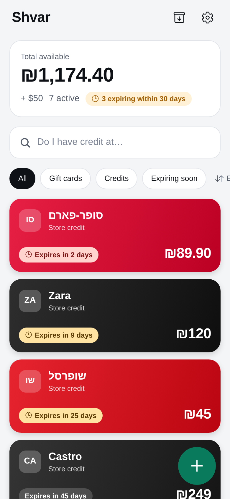
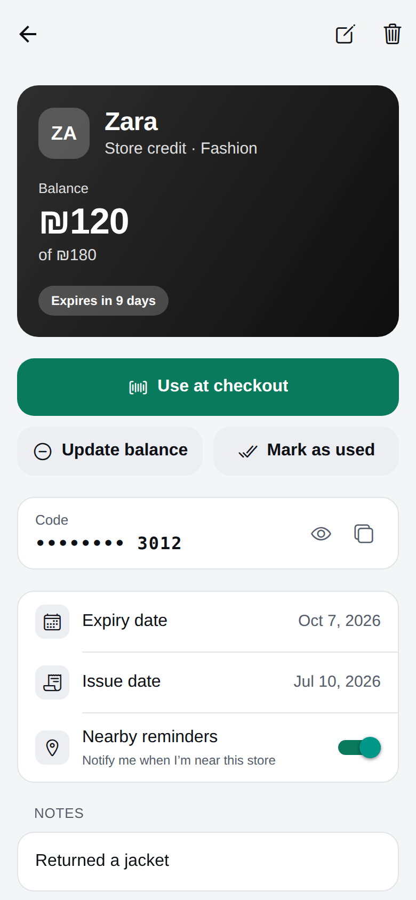
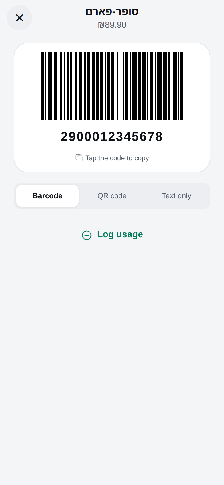
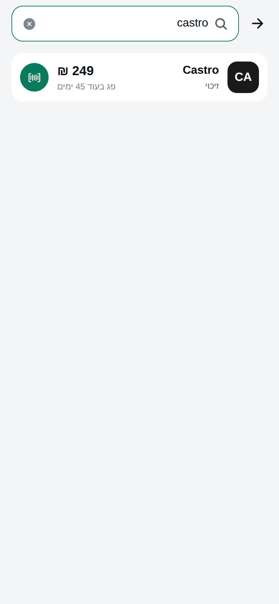
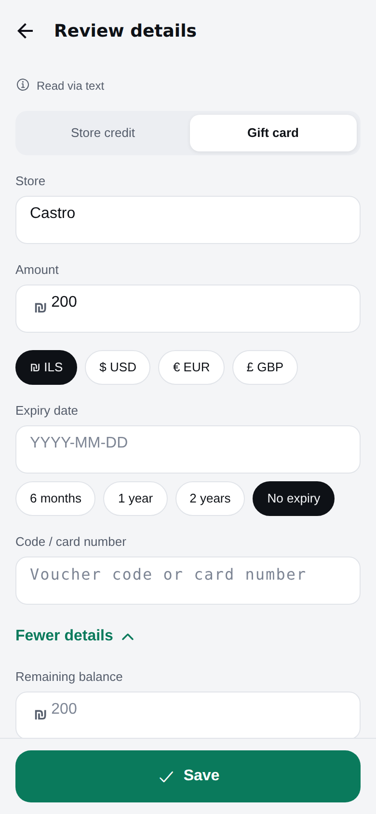
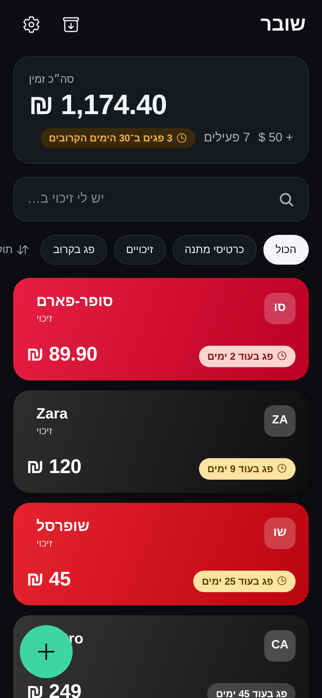

# Shvar (שובר) — a wallet for store credits & gift cards

Shvar keeps every store credit, return note and gift card in one private,
local-first wallet — so you always know what you have, where, and until when.

- **Snap a receipt → confirm → done.** Claude vision reads the store, amount,
  currency, dates and code; low-confidence fields are highlighted for review.
- **"Do I have credit here?"** Instant, typo-tolerant search that matches
  Hebrew and English spellings (`זארה` ↔ `Zara`, `supr farm` → `סופר-פארם`).
- **Nearby reminders.** "You have ₪120 credit at Zara, 150m away." — using the
  OS's low-power geofencing, opt-in, with per-card mute and a cooldown.
- **Expiry reminders** 14 and 3 days before (configurable).
- **Private by design.** All data stays on the device; codes and PINs are
  encrypted with a key in the Keychain/Keystore; optional Face ID / fingerprint
  lock.

| Home | Card | Checkout | Search (עברית) | Review after scan | Dark · RTL |
| --- | --- | --- | --- | --- | --- |
|  |  |  |  |  |  |

<sub>Screenshots are from the web development preview.</sub>

---

## Contents

1. [Quick start](#quick-start)
2. [Environment variables](#environment-variables)
3. [Receipt extraction (AI) setup](#receipt-extraction-ai-setup)
4. [What works where (Expo Go vs. development build)](#what-works-where)
5. [Testing location reminders with simulated locations](#testing-location-reminders-with-simulated-locations)
6. [Testing the share sheet, quick actions and notifications](#testing-the-share-sheet-quick-actions-and-notifications)
7. [Tests and quality checks](#tests-and-quality-checks)
8. [Building with EAS](#building-with-eas)
9. [Privacy & security](#privacy--security)
10. [Project structure](#project-structure)
11. [Known limitations & next steps](#known-limitations--next-steps)

Design decisions and trade-offs are documented in [DECISIONS.md](DECISIONS.md).

---

## Quick start

Requirements: Node 20+ and npm. For device builds: Xcode (iOS) / Android
Studio (Android), or an [Expo account](https://expo.dev) for cloud builds.

```bash
npm install
cp .env.example .env.local   # optional — see "Environment variables"
npx expo start               # scan the QR code with Expo Go, or press i / a
```

On first launch you'll see a three-page intro; choose **Explore with demo
cards** to load sample data (also available later in *Settings → Data*).

For the full feature set (background geofencing, share-into-app, quick
actions, on-device OCR), run a development build:

```bash
npx expo run:ios        # or: npx expo run:android
# or in the cloud:
npx eas-cli@latest build --profile development --platform ios
```

The web preview (`npx expo start --web`) is for development only: it renders
the UI but has no hardware-backed key store, camera OCR, notifications or
geofencing.

---

## Environment variables

Everything is optional; the app works without any keys (manual entry +
on-device OCR + OpenStreetMap). Copy `.env.example` to `.env.local` (git-ignored).
Expo inlines `EXPO_PUBLIC_*` values into the JS bundle at build time.

| Variable | Purpose |
| --- | --- |
| `EXPO_PUBLIC_ANTHROPIC_BASE_URL` | URL of the extraction proxy (`server/extraction-proxy.mjs`). **Recommended for production** — the real key stays on the server. |
| `EXPO_PUBLIC_ANTHROPIC_API_KEY` | With a proxy: the proxy's client token. Without a proxy: an Anthropic API key for **local development only** (it is bundled into the app). |
| `EXPO_PUBLIC_EXTRACTION_MODEL` | Claude model for extraction. Default `claude-opus-5-5`. |
| `EXPO_PUBLIC_GOOGLE_PLACES_API_KEY` | Optional Google Places API (New) key for store branch locations. Without it, OpenStreetMap (Overpass) is used. Restrict the key to the Places API and your app IDs. |

Keys can also be entered at runtime in **Settings** (*Receipt reading →
Anthropic API key*, *Nearby reminders → Google Places API key*); they are
stored in the device keychain, never in the database or logs, and take
priority over build-time values. Nothing is hardcoded in the source.

For EAS builds, define the same variables as
[EAS environment variables](https://docs.expo.dev/eas/environment-variables/)
(`npx eas-cli@latest env:create`) for the `development`, `preview` and
`production` environments referenced in `eas.json`.

---

## Receipt extraction (AI) setup

Extraction uses the official Anthropic TypeScript SDK
(`@anthropic-ai/sdk`) with structured outputs, so the response always
matches a JSON schema with a per-field confidence. The flow falls back to
on-device OCR (development builds) and finally to manual entry, and the
original image/PDF is always saved with the card.

**Option A — proxy (recommended):**

```bash
ANTHROPIC_API_KEY=sk-ant-... PROXY_CLIENT_TOKEN=$(openssl rand -hex 24) \
  node server/extraction-proxy.mjs            # listens on :8787
```

Deploy it anywhere that runs Node 20+ behind HTTPS, then in `.env.local`:

```bash
EXPO_PUBLIC_ANTHROPIC_BASE_URL=https://your-proxy.example.com
EXPO_PUBLIC_ANTHROPIC_API_KEY=<the PROXY_CLIENT_TOKEN value>
```

The proxy only forwards `POST /v1/messages`, checks the client token, limits
body size and restricts models (`ALLOWED_MODELS`). Add per-user auth/rate
limiting before exposing it publicly.

**Option B — personal use:** paste your own key in *Settings → Receipt
reading*. It's stored in the iOS Keychain / Android Keystore.

**Option C — local development:** `EXPO_PUBLIC_ANTHROPIC_API_KEY=sk-ant-...`
in `.env.local`. Don't ship a build like this.

The first time a receipt is read with AI, Shvar asks for consent and explains
that only the image is sent, only to extract details. AI reading can be turned
off in Settings at any time.

---

## What works where

| Feature | Expo Go | Development / production build |
| --- | --- | --- |
| Wallet, manual entry, search, archive, checkout codes | ✅ | ✅ |
| Receipt capture + AI extraction | ✅ | ✅ |
| On-device OCR fallback (`expo-text-extractor`) | — (skipped gracefully) | ✅ |
| Expiry reminders (local notifications) | ✅ | ✅ |
| Nearby reminders (background geofencing) | ❌ (background location isn't available in Expo Go on iOS) | ✅ |
| Share-into-app (iOS share extension / Android intents) | ❌ | ✅ |
| Home-screen quick actions | ❌ | ✅ |
| Face ID / fingerprint lock | ✅ | ✅ |
| Hebrew RTL layout | Text is translated; Expo Go resets RTL layout | ✅ |

---

## Testing location reminders with simulated locations

Nearby reminders need a development build (see above) and are **opt-in**.

1. Load demo cards (*Settings → Data → Load demo cards*) or add your own.
2. *Settings → Nearby reminders* → turn on → **Turn on nearby reminders** →
   allow location **"Always" / "Allow all the time"** and notifications.
3. Give the app a store location. Either:
   - **Deterministic (no network):** simulate your position at the "store",
     open a card and tap **"I'm at this store now"** (pins the branch), or
   - **Real data:** simulate a position in a city; the app looks up branches
     of stores you have credit for (Google Places with a key, else
     OpenStreetMap) and caches them for 30 days.
4. Move the simulated location **> 2 km away**, send the app to the
   background, then move back to the store (or play the route in
   `docs/simulate/azrieli-walk.gpx`, which ends at Azrieli Mall, Tel Aviv).
5. You should get *"You have ₪… credit at …, …m away."* Tapping it opens the card.

Simulating locations:

- **iOS Simulator:** *Features → Location → Custom Location…*, or
  `xcrun simctl location booted set 32.0741,34.7922`. For a route:
  `xcrun simctl location booted start --speed=1.4 32.0853,34.7818 32.0741,34.7922`.
  In Xcode you can also add the GPX file and use *Debug → Simulate Location*.
- **Android emulator** (use a Google Play system image — geofencing needs
  Play services): *Extended controls (⋯) → Location* → set a point or import
  the GPX under *Routes* and press play. Or: `adb emu geo fix 34.7922 32.0741`
  (longitude first).

Tips:

- *Settings → Nearby reminders → Send a test reminder* shows the notification
  immediately, without moving.
- The per-store **cooldown** (default 12 h) suppresses repeats — lower it to
  4 h in Settings while testing, or reinstall to reset.
- *Refresh nearby stores* re-plans the geofences now; the subtitle shows how
  many stores are being watched.
- iOS reports the initial state of regions right after registration, so you
  may get a reminder immediately if you're already inside a store's radius.
- Android does not relaunch a force-stopped app for geofence events (see
  [dontkillmyapp.com](https://dontkillmyapp.com)).

---

## Testing the share sheet, quick actions and notifications

- **Share a gift card link:** in a development build, share a link (or a
  WhatsApp/email message containing one) from Safari/Chrome/WhatsApp →
  *Shvar*. You land on the review screen with the store/amount prefilled.
  Sharing an image or PDF runs the receipt pipeline. On iOS the share
  extension uses an App Group (`group.com.shvar.wallet`); EAS sets up the
  capability automatically for your own bundle identifier.
- **Paste a link:** *+ → Paste a link*, e.g.
  `קיבלת שובר מתנה לקסטרו על סך 200 ₪ https://buyme.co.il/gift/XYZ`.
- **Quick actions:** long-press the app icon → *Find credit* (opens search
  with the keyboard up) / *Scan receipt* (opens the camera) / *Add card*.
- **Expiry reminders:** add a card expiring in 4 days, and in *Settings →
  Expiry reminders* enable "3 days before" and pick the next hour; or change
  the device date forward.

---

## Tests and quality checks

```bash
npm test            # Jest (jest-expo) — 200+ tests
npm run typecheck   # tsc for app and tests
npm run lint        # ESLint (eslint-config-expo, React Compiler rules)
npm run check       # all of the above
npx expo-doctor     # dependency / config health
```

What's covered:

- **Data layer** — repositories and migrations run against real SQLite
  (`sql.js`): CRUD, balance history, archive transitions, expiry sweep,
  soft deletes, and that codes/PINs never hit the database in plaintext.
- **Encryption** — AES-GCM round trips, tamper detection, wrong-key failure.
- **Search** — exact/prefix/typo/cross-script matching on Hebrew and English
  names, precision (no false positives), performance on 1,000 cards.
- **Extraction parsing** — normalization of model output (confidence
  highlighting, currencies, dates, plausibility), the Hebrew/English receipt
  parser, the exact Claude request (headers, schema, PDF blocks, error
  mapping) via the real SDK against a mock API, and the proxy end-to-end.
- **Links & sharing** — page metadata, store detection, share routing.
- **Reminders** — expiry planning/reconciliation; geofence planning,
  places cache and cooldown, providers, notification copy.
- **Barcodes** — Code 128 and QR output verified by decoding with ZXing.
- **i18n** — Hebrew/English key and placeholder parity.

---

## Building with EAS

```bash
npx eas-cli@latest login
npx eas-cli@latest build --profile development --platform all   # dev client
npx eas-cli@latest build --profile preview --platform android    # internal APK
npx eas-cli@latest build --profile production --platform all
```

Change `ios.bundleIdentifier` / `android.package` in `app.json` to your own
identifiers before the first build.

---

## Privacy & security

- **Local-first.** Cards, balances, history and attachments live only in the
  app's SQLite database and documents folder. There is no account and no
  server of ours.
- **Codes and PINs are encrypted** (AES-256-GCM) with a random key stored in
  the iOS Keychain / Android Keystore via `expo-secure-store`. List views never
  decrypt them; revealing or copying one can require biometrics.
- **Optional app lock** with Face ID / Touch ID / fingerprint (or device
  passcode). While the lock is on, the app re-locks after a minute in the
  background and hides its content in the app switcher.
- **AI extraction:** when enabled, the receipt image/PDF — and nothing else —
  is sent to Anthropic's Claude API (directly or via your proxy) only to
  extract the details. Stated in-app on the scan screen and on first use.
- **Store locations:** only a store name and a ~11 km area centre are sent to
  Google Places / OpenStreetMap — never your exact position. Geofencing runs
  on-device.
- **Link previews:** when you add a gift card link, the app fetches that page
  to read its title and amount.

---

## Project structure

```
src/
  app/                 Expo Router screens (home, search, add, scan, link, item/[id]/…, settings, onboarding)
  components/          Design system (ui/), wallet tiles & code display (item/), forms, settings sections
  domain/              Types, money, dates, status/filter/sort, validation
  db/                  SqlDriver interface, expo-sqlite driver, migrations, repositories
  security/            AES-GCM field cipher, keychain key store
  search/              Normalization, Hebrew/English phonetic skeletons, fuzzy scorer, brand dictionary
  extraction/          Claude client, JSON schema, normalizer, OCR + text heuristics, pipeline
  links/               Link analysis, page metadata, share-sheet routing
  notifications/       Expiry planner + scheduler, notification routing
  location/            Geo math, geofence planner, places providers + cache, background task
  services/            Bootstrap, attachments, pickers, security (lock), quick actions, demo seed
  i18n/                English + Hebrew strings
  theme/               Tokens, colors, theme provider
server/                Optional extraction proxy (Node, no dependencies)
test/                  Jest tests (+ sql.js driver, fixtures)
docs/                  Screenshots and a GPX route for location testing
```

---

## Known limitations & next steps

- **Home-screen widget** (stretch goal) is not implemented. `expo-widgets`
  (iOS) or a native Android widget could show total credit and the next
  expiring card from the same SQLite data.
- **Cloud sync/backup** is not implemented, but the schema is ready for it
  (UUIDs, `updated_at`, tombstones, end-to-end-encrypted secrets). See
  DECISIONS.md → M1.
- **On-device OCR** on Android (ML Kit) reads Latin script only; Hebrew
  receipts rely on AI extraction.
- **Store coverage** from OpenStreetMap varies; add a Google Places key or pin
  locations for small shops.
- **Balance lookup** for gift card links isn't automatic — most voucher sites
  require login; the amount is read from the shared message or page when
  available.
